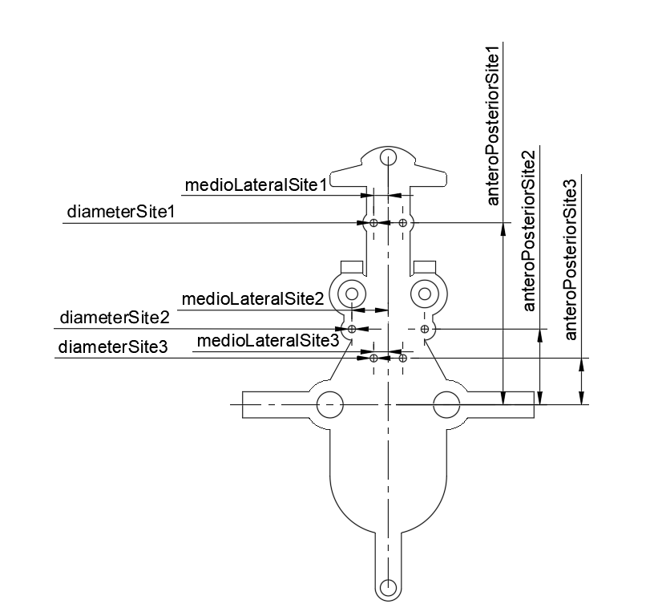

# TD Drive
Here, we present a novel, 3D-printable implant for rats, named TD Drive, capable of symmetric, bilateral wire electrode recordings, currently in up to six distributed brain areas simultaneously. The open-source design was created employing parametric design principles, allowing prospective users to easily adapt the drive design to their needs by simply adjusting high-level parameters, such as anterior-posterior and medio-lateral coordinates of the recording electrode locations.

We set out to create an easily adjustable hyperdrive to aid neuroscientists in overcoming the difficulties brought about by the multi-area nature of brain interactions. This is one of the main obstacles faced by researchers aiming to exhaustively study the ongoing physiological processes in the brain during both wakefulness and sleep. To capture them accurately, extracellular electrophysiology, recorded with electrodes implanted in the brain areas of interest, is one of methods of choice due to its high temporal resolution and spatial precision.

Classically, studies recording brain activity with extracellular electrodes have employed individual wire electrodes or electrode bundles, such as tetrodes. State-of-the-art probes such as the Neuropixels probe allow the targeting of several areas simultaneously, given that they are aligned on an axis that does allow for implantation of the probe along that axis without impairing the animal. However, accurate simultaneous recordings of multiple, spatially separated areas still remain challenging, with existing methods being either costly or time intensive. 

To make this kind of research more accessible to the scientific community, we set out to create a hyperdrive design that can be modified by individual users, all while being producible in-house. The TD Drive thus aims to overcome some of the drawbacks of existing solutions: it allows targeting of multiple brain areas, mirrored across both hemispheres, with independent wire electrodes simultaneously. Due to its simple design, it can be assembled in a few hours at a relatively low cost. We publish the TD Drive open source, in easily modifiable file formats, to allow researchers to adjust it to their specific needs. A protective cap and electrode interface board (EIB), both available in a standard and enlarged version, complete the experimental framework. The enlarged versions provide increased freedom to make parametric changes to the drive body. Incorporating a parametric 3D modeling approach from the beginning of the TD Drive’s design process allowed us to abstract the parameters necessary to be changed: to change target locations, researchers can simply edit the parameters representing their dorsoventral and anteroposterior coordinates, without the need for redesigning the drive themselves.

 

# Parameters
*The parametric design was created in Autodesk Fusion 360. To edit the parameters described below, you will need to import the f3d file into Fusion 360. At time of publication, a free Fusion 360 license for academics/educators was available from Autodesk.*

The TD Drive was designed using a parametric modeling approach. In this process, popular in computer-aided design, different components of the design are linked by interdependent parameters and a defined design history. The design can be altered to suit your needs by modifying the parameters controlling the relevant dimensions. This eliminates the need for researchers to redesign the model themselves, with simple changes to the high-level parameters taking care of all the desired design modifications.

Apart from changing dimensions of the design, the parametric functionality is also used to provide the option to bilaterally add a set of fibers to the body. To make opting in and out of adding the fibers depending on your experimental needs as simple as possible, a custom-made plugin (hyperlink) for Fusion 360 is provided. With use of this plugin, the suppression of all design features pertaining to the fibers can be toggled with the use of a single parameter.

The table below contains the parameter names, a description of their function and some relevant notes regarding their impact on the design. A graphical representation of the parameters for the drive body is available in the form of a drawing that can be found in the design files folder (see preview image below). It  demonstrates the precise, physical dimensions corresponding to the most important parameters (in italics and marked bold in the table as well). This drawing, in combination with the table, can be used to easily visualize and determine what parameters should be modified for the changes that you wish to make.

| **Name**                     | **Function**                                                                                                                                                                                     | **Default value** | **Notes**                                                                                                                                  |
|------------------------------|--------------------------------------------------------------------------------------------------------------------------------------------------------------------------------------------------|-------------------|--------------------------------------------------------------------------------------------------------------------------------------------|
| actualMedioLateralSite1      | Defines the definitive mediolateral position of the anterior recording site by checking the target position against the maximum.                                                                 | 1 mm              | if(medioLateralSite1 <= maxMedioLateralSite1; medioLateralSite1; maxMedioLateralSite1)                                                     |
| actualMedioLateralSite2      | Defines the definitive mediolateral position of the medial recording site by checking the target position against the maximum.                                                                   | 2.5 mm            | if(medioLateralSite2 <= maxMedioLateralSite2; medioLateralSite2; maxMedioLateralSite2)                                                     |
| actualMedioLateralSite3      | Defines the definitive mediolateral position of the posterior recording site by checking the target position against the maximum.                                                                | 1 mm              | if(medioLateralSite3 <= maxMedioLateralSite3; medioLateralSite3; maxMedioLateralSite3)                                                     |
| anteroPosteriorFiber         | Adjusts the target anteroposterior distance of the optical fiber holes, taking into account any scaling based on the difference between measured and default bregma-lambda distances.            | 7.7 mm            | ( distanceBregmaLambda + targetAnteroPosteriorFiber ) * ( measuredDistanceBregmaLambda / distanceBregmaLambda )                            |
| **_anteroPosteriorSite1_**   | **_Adjusts the target anteroposterior distance of the anterior recording site, taking into account any scaling based on the difference between measured and default bregma-lambda distances._**  | **_12.5 mm_**     | **_( distanceBregmaLambda + targetAnteroPosteriorSite1 ) * ( measuredDistanceBregmaLambda / distanceBregmaLambda )_**                      |
| **_anteroPosteriorSite2_**   | **_Adjusts the target anteroposterior distance of the medial recording site, taking into account any scaling based on the difference between measured and default bregma-lambda distances._**    | **_5.2 mm_**      | **_( distanceBregmaLambda + targetAnteroPosteriorSite2 ) * ( measuredDistanceBregmaLambda / distanceBregmaLambda )_**                      |
| **_anteroPosteriorSite3_**   | **_Adjusts the target anteroposterior distance of the posterior recording site, taking into account any scaling based on the difference between measured and default bregma-lambda distances._** | **_3.2 mm_**      | **_( distanceBregmaLambda + targetAnteroPosteriorSite3 ) * ( measuredDistanceBregmaLambda / distanceBregmaLambda )_**                      |
| diameterBrassInsert          | Controls the diameter of the hole reserved for the brass insert of the shuttle assembly to lower into.                                                                                           | 1.9 mm            |                                                                                                                                            |
| diameterEIBScrew             | Controls the diameter of the holes used to join the drive body to the EIB.                                                                                                                       | 1.8 mm            |                                                                                                                                            |
| diameterShuttleScrewMajor    | Controls the major diameter of the cover for the shuttle screw.                                                                                                                                  | 0.9 mm            |                                                                                                                                            |
| diameterShuttleScrewMinor    | Controls the minor diameter of the cover for the shuttle screw.                                                                                                                                  | 0.8 mm            |                                                                                                                                            |
| **_diameterSite1_**          | **_Controls the diameter of the most anterior recording site._**                                                                                                                                 | **_0.5 mm_**      |                                                                                                                                            |
| **_diameterSite2_**          | **_Controls the diameter of the most medial recording site._**                                                                                                                                   | **_0.5 mm_**      |                                                                                                                                            |
| **_diameterSite3_**          | **_Controls the diameter of most posterior recording site._**                                                                                                                                    | **_0.5 mm_**      |                                                                                                                                            |
| distanceBregmaLambda         | Controls the distance between the projected Bregma and Lambda points.                                                                                                                            | 9 mm              |                                                                                                                                            |
| distanceFrontBackEIBHoles    | Controls the distance between the front and back screw holes used to possibly further join the drive body and EIB.                                                                               | 29.601 mm         | These holes are currently not in use for fastening the EIB, the larger more medial holes are sufficient.                                   |
| distanceMedioLateralEIBHoles | Controls the mediolateral distance of the EIB screw holes.                                                                                                                                       | 4 mm              | With respect to the midline.                                                                                                               |
| heightShuttleGuide           | Controls the height to which the shuttle guide extends above the top surface of the body.                                                                                                        | 8.2 mm            | thicknessDriveBodyTop + 6 mm                                                                                                               |
| lengthBackPedestals          | Controls the length of the supporting pedestals where the polyamide screws for the EIB thread into.                                                                                              | 15.2 mm           |                                                                                                                                            |
| lengthShuttleScrew           | Controls the length of the cover of the movable shuttle assembly.                                                                                                                                | 15.2 mm           |                                                                                                                                            |
| maxMedioLateralSite1         | Controls the maximum mediolateral position of the anterior recording site.                                                                                                                       | 2 mm              | It is not recommended to alter these maximum limits, interactions between model features can fail when pushing beyond the default limits.  |
| maxMedioLateralSite2         | Controls the maximum mediolateral position of the medial recording site.                                                                                                                         | 5 mm              | It is not recommended to alter these maximum limits, interactions between model features can fail when pushing beyond the default limits.  |
| maxMedioLateralSite3         | Controls the maximum mediolateral position of the posterior recording site.                                                                                                                      | 2 mm              | It is not recommended to alter these maximum limits, interactions between model features can fail when pushing beyond the default limits.  |
| measuredDistanceBregmaLambda | Sets the individually measured bregma-lambda distances to be used for scaling the final positions to ensure accuracy.                                                                            | 9 mm              | This value is used in scaling calculations of the final position, set it to 9 mm (distance used in designing) to disable scaling.          |
| medioLateralFiber            | Controls the mediolateral distance of the optical fiber holes.                                                                                                                                   | 1 mm              | Change this parameter to your intended position with respect to the midline.                                                               |
| **_medioLateralSite1_**      | **_Controls the mediolateral distance of the most anterior recording site._**                                                                                                                    | **_1 mm_**        | **_Change this parameter to your intended position with respect to the midline. The maximum limits will automatically be applied._**       |
| **_medioLateralSite2_**      | **_Controls the mediolateral distance of the most medial recording site._**                                                                                                                      | **_2.5 mm_**      | **_Change this parameter to your intended position with respect to the midline. The maximum limits will automatically be applied._**       |
| **_medioLateralSite3_**      | **_Controls the mediolateral distance of the most posterior recording site._**                                                                                                                   | **_1 mm_**        | **_Change this parameter to your intended position with respect to the midline. The maximum limits will automatically be applied._**       |
| supressFiber                 | Provides the interface with the API script to control suppression of all features pertaining to the optical fiber holes.                                                                         | 0                 | After setting either a value of 0 or 1, the corresponding Fusion 360 API script should be run to actuate the suppression.                  |
| tapDepth                     | Controls the length of the shuttle screw cover that will be tapped in post-production.                                                                                                           | 3.9 mm            |                                                                                                                                            |
| targetAnteroPosteriorFiber   | Sets the target anteroposterior position of the optical fiber holes with respect to bregma.                                                                                                      | -1.3 mm           | Change this parameter to your intended position and any scaling and maximum limit calculations will be performed and applied to the model. |
| targetAnteroPosteriorSite1   | Sets the target anteroposterior position of the anterior recording site with respect to bregma.                                                                                                  | 3.5 mm            | Change this parameter to your intended position and any scaling and maximum limit calculations will be performed and applied to the model. |
| targetAnteroPosteriorSite2   | Sets the target anteroposterior position of the medial recording site with respect to bregma.                                                                                                    | -3.8 mm           | Change this parameter to your intended position and any scaling and maximum limit calculations will be performed and applied to the model. |
| targetAnteroPosteriorSite3   | Sets the target anteroposterior position of the posterior recording site with respect to bregma.                                                                                                 | -5.8 mm           | Change this parameter to your intended position and any scaling and maximum limit calculations will be performed and applied to the model. |
| thicknessDriveBodyBottom     | Controls the thickness of the bottom section of the drive body.                                                                                                                                  | 0.8 mm            |                                                                                                                                            |
| thicknessDriveBodyTop        | Controls the thickness of the top section of the drive body.                                                                                                                                     | 2.2 mm            |                                                                                                                                            |

# Manufacturing
With the open-source availability of all the relevant files for our hyperdrive framework, all parts can be made in-house. The drive body and cap components can be 3D printed while the custom EIB requires dedicated printed circuit board (PCB) production facilities. When not in possession of adequate equipment or skills, the production can be outsourced to dedicated companies using the available files. We acquire the EIBs externally and print all cap components and the hyperdrive bodies using a commercially available high-resolution 3D printer. Printing of the bodies is occasionally outsourced to specialized services to ensure quality whenever desired or required.

# Assembly
A number of post-processing and assembly steps are needed before the drive can be used in experiments. A detailed protocol is available on request. Please contact contact@3dneuro.com for further details. This protocol can be used as a guide for the complete assembly process to ensure the successful production of TD Drives.

# License
Copyright 3Dneuro 2022. This source describes Open Hardware and is licensed under the CERN-OHL-S v2 You may redistribute and modify this documentation and make products using it under the terms of the CERN-OHL-S v2 (https:/cern.ch/cern-ohl). This documentation is distributed WITHOUT ANY EXPRESS OR IMPLIED WARRANTY, INCLUDING OF MERCHANTABILITY, SATISFACTORY QUALITY AND FITNESS FOR A PARTICULAR PURPOSE. Please see the CERN-OHL-S v2 for applicable conditions. Source location: https://www.3dneuro.com/open-hardware/ https://choosealicense.com/licenses/cern-ohl-s-2.0/
